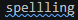
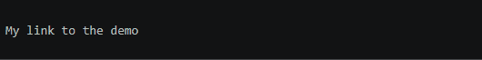

# Useful tools to help you create quality content

#### Included Recommended VS Code Extensions
!!! tool "Code Spell Checker"
    Will help catch spelling errors and typos in your lab guides.  
    The detected spelling error will have a squiggly underline like:   
    After positioning the cursor in the word, any of the following should display the list of suggestions:  
    > Click on the 💡 (lightbulb) in the left hand margin.  
    > Quick Fix Editor action command:  
    >> Mac: ⌘+. or Cmd+.  
    >> PC: Ctrl+.  
!!! tool "Markdown All In One"
    Allows you to use common keyboard shortcuts for making text **bold** and *italic* without needing to memorize the Markdown syntax.  
    You can change heading levels using `ctrl + shift + ]` to uplevel and `ctrl + shift + ]` to downlevel.
    Allows you to easily create hyperlinks by pasting the URL on highlighted text.
    ??? gif "Show Me"
        

#### Gif Creation Software Suggestions
> PC: [ScreenToGif](https://apps.microsoft.com/detail/9n3sqk8pds8g){:target="_blank"}  
> Mac: [Giphy](https://giphy.com/apps/giphycapture){:target="_blank"}  

#### MK Docs Feature Reference:
> [https://squidfunk.github.io/mkdocs-material/reference/](https://squidfunk.github.io/mkdocs-material/reference/){:target="_blank"}  

#### Markdown Cheat Sheets: 
> [https://www.markdownguide.org/cheat-sheet/](https://www.markdownguide.org/cheat-sheet/){:target="_blank"}  
>
> [https://github.com/lifeparticle/Markdown-Cheatsheet](https://github.com/lifeparticle/Markdown-Cheatsheet){:target="_blank"}  

